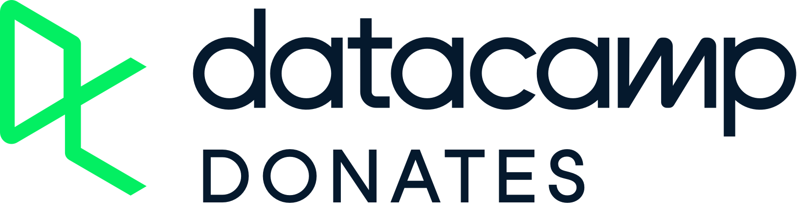

# DEP x DataCamp Donates Scholarship Application Now Open!

We’re thrilled to announce that Data Engineering Pilipinas is now a proud partner of DataCamp Donates! Thanks to this partnership, we’re offering exclusive scholarships for free premium access to DataCamp’s top-tier data science courses and resources.

**What to Expect:**

- **Premium Access:** Unlock top-tier data science courses from DataCamp.
- **Learning Journey:** Enhance your skills and advance your career with cutting-edge content.
- **Community Support:** Join a network of like-minded learners and grow together.

**Rules and Expectations:**

- **Monthly Assignments:** 4,000 XP (roughly 3 hours of learning per month)
- **Use Hashtags:** Tag @DataCamp and use #dcdonates in your posts to keep the community updated.
- **Engage with Content:** Actively participate in the courses and engage with other learners.
- **Share Success Stories:** We’d love to hear and share your success stories! Let us know how the courses are helping you grow.

**What You Need to Do:**

- **Apply Now:** Submit your application for the scholarship.
- **Engage:** Plan to actively participate and complete courses.
- **Finish Monthly Assignment:** 4,000 XP, failed to do so will have your access revoked.

We’re excited to support your learning journey and can’t wait to see the incredible progress you make. Apply today and take the first step towards mastering data science!

#DataCampDonates #Scholarship #DataEngineeringPilipinas #DataAnalysis #DataScience #DataEngineering #MachineLearning #ArtificialIntelligence #DataLiteracy #ApplyNow #dcdonates

**Start Your Application:**

- [APPLY NOW](https://forms.gle/a9sjVvcZNfG6PZXD7)

---

# DEP x DC Donates - Frequently Asked Questions

**Q1: Who is eligible for the DataCamp sponsorship?**
- A1: The DataCamp sponsorship is available to all Filipino members of Data Engineering Pilipinas. The scholarship includes 12 months of unlimited premium access to Datacamp.

**Q2: How will I know the status of my application? Please check our Status Checker**

**Application Status: Action Required**
- A2.1: If your application status shows “Action Required,” it may be due to one or more of the following:
Incomplete Information 
  - Some required details (e.g., full name, correct birthdate, or other required fields) may be missing.
Incorrect Information 
  - Certain details provided may be inaccurate or cannot be verified.
Response Needs Clarification 
  - One or more answers may require further explanation or do not fully meet the evaluation criteria.

**What should you do?**

Please double-check all the information you submitted and review your responses carefully. If edits are allowed, update your application accordingly. Otherwise, please wait for further instructions from our team.

*To address these issues, ensure all information provided is complete and accurate.*

**Application Status: Pending Review**
- A2.2 If your application status shows “Pending Review,” it means your submission has not yet been evaluated.

*Our team reviews applications by batch, and all administrators are volunteers. We appreciate your patience as we carefully assess each application.*

**What should you do?**

 No action is needed at this time. Please wait for further updates once your batch is scheduled for review.

**Application Status: Email Not Found**

If your status shows “Email Not Found,” we were unable to locate your email address in our application records.

This may happen if:

- The email address entered was incorrect or misspelled
- The application form was not successfully submitted
- A different email address was used during submission

**What should you do?**

 Please double-check the email address you provided and review your confirmation (if any). You may also revisit the Google Form to ensure your application was successfully submitted. If needed, you can submit a new application using the correct email address.

If you do not receive a confirmation email within the expected timeframe, your application may still be under review. We appreciate your patience as our team processes applications in batches.

**Q3: How can I avoid common mistakes in my application?**
- A3: To avoid common mistakes:
  - Carefully Read Instructions: Follow all instructions on the application form.
  - Provide Accurate Information: Ensure personal details like full name, birthday, city, and country are correct.
  - Complete All Sections: Fill out every section of the form completely.

**Q4: What should I do if my application is incomplete?**
- A4: If you suspect your application is incomplete:

  - Double-check Personal Details: Ensure full name, correct birthday, and other required information are accurately filled.
  - Complete the Form: Fill out all sections of the form.
  - If it has been a while since submission without a response, review and complete your application.

**Q5: Is there a chance that my access will be revoked?**
- A5: There are a few mechanics that will entail removal of DataCamp access.
  - Non-Acceptance: If you have been invited but do not accept after a few reminders, your invitation will be withdrawn.
  - Non-Usage: Accounts are being monitored and if they are not being used, we will revoke your access.
  - We only have limited slots for the partnership and we want to prioritize access to those that need and will use the platform.

**Q6: I really like this initiative. How can I support it?**

- A6: We appreciate your support! You can help grow the DEP x DataCamp initiative in many ways:
  - Invite your friends and colleagues who are interested in data to join the community.
  - Encourage others to apply to the [DEP x DC Scholarship Program](https://dataengineering.ph/#official-datacamp-donates-partner).
  - Share your learning journey and milestones on social media please follow the official posting [guidelines](https://dataengineering.ph/about.html#official-community-guidelines); [Facebook](https://www.facebook.com/groups/dataengineeringpilipinas), [Discord](https://discord.com/invite/buDgydz7J9), and [Linkedin](https://www.linkedin.com/company/dataengineeringpilipinas).
  - Help fellow learners in the Data Engineering community by answering questions, sharing best practices, and offering guidance.
  - Join the official [DataCamp GC](https://m.me/ch/AbaaFmzyN7tstTS9/) and actively participate in discussions.
Participate in DEP surveys and community initiatives to help us improve the program.
  - Share your milestones and success stories directly with DataCamp through the official submission link.

*At the heart of this initiative is community. Let’s continue supporting one another and grow together one dataset at a time.
Tell your success here story to motivate others*

**Q7: Who can I contact if I have questions about my application?**
- A7: Kindly review the DATACAMP DONATES x DEP Partnership mechanics for further guidance or ask the community. Visit Data Engineering Pilipinas and join the different DEP communities to connect with other members.

**Q8: How long before you take a slot from someone?**
- A8: A Datacamp premium is around 29USD / month, So we want to maximize that for the community for the next 12 months. These are general guidelines, but the message is if you don’t use it, you don’t need it. You may get removed automatically without warning.
  - if we send an invite and no acceptance after 2 weeks
  - if accepted but no usage after 2 weeks
  - if 4K XP monthly assignment is not completed within 4 weeks
  - The principle is, if you are using it you shouldn’t worry.

**Q9: Why is my application not yet approved?**
- A9: Common reasons why applications are not approved include providing incomplete or incorrect information, or failing to answer the questions thoughtfully and seriously. These issues may suggest a lack of sincerity or genuine intent in applying for the scholarship.

While we aim to make the opportunity accessible to as many individuals as possible, we have limited scholarship slots and volunteer resources to review applications. As such, we prioritize applicants who demonstrate honesty, care, and a clear intention to fully utilize the opportunity.

We kindly ask applicants to complete all sections accurately and respond to questions with genuine effort and reflection.

**Q10: Are there curated tracks by DEP?**

- A10: DEP does not provide its own curated tracks. However, DataCamp offers extensive learning tracks that you can choose from based on your interests and goals. For guidance on which tracks to follow, please refer to the [DEP Roadmaps](https://dataengineering.ph/study-roadmap.html).

**Q11: Do we have teams?**
- A11: As of now, we don’t have teams. All learners participate individually.

**Q12: Can I share my success story?**

- A12: We are currently ALWAYS in the processing of promoting the Data Engineering Pilipinas x Datacamp Donates partnership. If you’ve benefited from this scholarship and would love to see it continue, we’d greatly appreciate your support. Sharing your success story—how access to DataCamp has helped your learning or career journey can make a big difference in demonstrating the impact of this initiative. Your testimonial will help strengthen our case to keep this valuable opportunity alive for future scholars.
SUBMIT YOUR SUCCESS STORY: [here](https://docs.google.com/forms/d/e/1FAIpQLSeZK-3tP6zzzhOn5LpejKmzAf9Wu0rZzQ2EQ_g2sYxvLPMlfA/viewform)

**Q13: What happens if it expires?**
- A13: There are two things that might expire, one is your scholarship, the other is the partnership.
  - Scholarship - The scholarship expires after 12 months. It can also expire if you do not use it for a long time (in terms of XP earned). You can re-apply again on the form if you’d like to renew your access.
  - Partnership - DEP’s partnership with Datacamp Donates is worth 12 months as well. So make sure to submit success stories (see above) to keep promoting the impact of our community through Datacamp and we can continue to renew the partnership.

**Q14: What if my DataCamp account is not registered using Gmail?**
- A14: If your DataCamp account is not registered using Gmail, you have two options:
  - Option 1: Create a new DataCamp account using the Gmail address you used during registration.
  - Option 2: Update your existing DataCamp account email to the same Gmail address you used during registration.

| **Reason for Non-approval**                 | **Description**                                                                                                                                                                            | **Examples**                                                                                               |
|------------------------------------------|--------------------------------------------------------------------------------------------------------------------------------------------------------------------------------------------|------------------------------------------------------------------------------------------------------------|
| **Incomplete Information**               | Applications missing essential details such as name, last name, gender, birthdate, or address may be not approved. These details are crucial for verifying the applicant's identity and ensuring proper communication. Without complete information, the application cannot be properly reviewed or processed. | No name, last name, gender, birthday, etc.                                                                  |
| **Did Not Answer Required Questions**    | Certain questions in the application are mandatory and are designed to assess the applicant's qualifications, goals, or suitability for the scholarship. Failing to answer these required questions indicates an incomplete application, which cannot be considered for evaluation. | Required questions were answered with ??????                                                                 |
| **Incorrect Details**                    | Providing incorrect information, such as an inaccurate address or wrong birthdate, may lead to disqualification. Accurate details are essential for validating the applicant's eligibility and ensuring that all provided data is truthful and up to date. Errors in basic information can reflect a lack of attention to detail. | Birthday listed as 2024, country as 8, age listed as 23 years, wrong spelling of "Philippines."              |
| **Not Taking the Application Seriously** | Comments or answers that lack seriousness or are inappropriate may lead to non-approval. The application process is designed to evaluate candidates' commitment and sincerity toward the scholarship. Submissions that appear careless or disrespectful indicate a lack of seriousness and can result in disqualification. | All answers are just "yes" to all questions, inappropriate responses such as "ChatGPT said this and that." |

We have a lot of [FREE LEARNING RESOURCES](resources.qmd) which you can utilize if you wish for alternatives.

---
