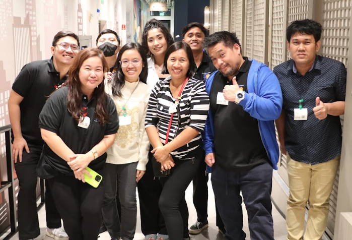

## Leaders & Volunteers of Data Engineering Pilipinas

Data Engineering Pilipinas is powered not only by its members, but also by the leaders, moderators, and volunteers who continuously give their time, ideas, and energy to help the community grow.

This page recognizes the people who contribute to DEP through programs, events, study groups, mentorship, moderation, content, partnerships, and community-building initiatives. Their efforts help make DEP a welcoming, volunteer-driven, and impact-oriented community for aspiring and practicing data professionals in the Philippines.

We thank each of them for helping move the community forward.

## What Community Leadership Means in DEP

Community leadership in DEP can take many forms, including:

- Moderating discussions and helping maintain a safe, respectful environment
- Organizing or supporting programs, events, and study groups
- Leading initiatives such as mentorship, podcast, meetup, Discord, YouTube, and project activities
- Helping members learn, connect, and grow through shared experiences
- Contributing behind the scenes to strengthen the DEP ecosystem

## Moderators

| Name | Role | Projects / Programs | LinkedIn |
|---|---|---|---|
| Bea Lambitco | Moderator | Humans of DEP, Programs | [LinkedIn](https://www.linkedin.com/in/bea-lambitco/) |
| Danielle Bagaforo Meer | Moderator | AI Study 2025, AI Study 2026, The Puso Project 2025, The Puso Project 2026, Paper Review Club 2026, Discord | [LinkedIn](https://www.linkedin.com/in/algorexph/) |
| Engramar Bollas | Moderator | The Puso Project 2025, The Puso Project 2026 | [LinkedIn](https://www.linkedin.com/in/engramarbollas/) |
| Jonald Tenio | Moderator | Programs, Podcast | [LinkedIn](https://www.linkedin.com/in/dwg-jonten-r-929175280/) |
| Josh Valdeleon | Moderator | Programs, DataMasters 2025, YouTube, Meetup, Discord, Mentorship, Project Challenges, Podcast | [LinkedIn](https://www.linkedin.com/in/josh-valdeleon/) |
| Katherine Bulac | Moderator | DataCamp 2026, DataMasters 2025, AI Study 2025, The Puso Project 2025, The Puso Project 2026, YouTube, Meetup, Discord | [LinkedIn](https://www.linkedin.com/in/katherinebulac/) |
| Kristine Cristobal | Moderator | DataMasters 2025, AI Study 2025, YouTube, Meetup, Discord, Podcast | [LinkedIn](https://www.linkedin.com/in/kristine-cristobal-71507113/) |
| Mike Bellen | Moderator | DataCamp 2024, DataCamp 2025, DataCamp 2026, DataMasters 2024, The Puso Project 2025, The Puso Project 2026, Podcast | [LinkedIn](https://www.linkedin.com/in/mikebellen/) |
| Nina Comia | Moderator | Programs, DataMasters 2025, Mentorship, Podcast | [LinkedIn](https://www.linkedin.com/in/nina-comia/) |
| Renan Matthew Arana Fajardo | Moderator | DataCamp 2026, DataMasters 2025, DataMasters 2026 | [LinkedIn](https://www.linkedin.com/in/irenanmatthew/) |
| Renzi Vidal | Moderator | AI Study 2025, AI Study 2026 | [LinkedIn](https://www.linkedin.com/in/ultrenz-vidal/) |
| Sandy Lauguico | Moderator | Meetup, Mentorship | [LinkedIn](https://www.linkedin.com/in/sandy-lauguico/) |
| Sandy Cabanes | Moderator | DataMasters 2024, State of the Community Survey 2024, State of the Community Survey 2025 | [LinkedIn](https://www.linkedin.com/in/sandygcabanes/) |
| Vanessa Althea Bermudez | Moderator | AI Study 2026, DataMasters 2025, YouTube, Meetup | [LinkedIn](https://www.linkedin.com/in/vaniebermudez/) |
| Yui Otsuka | Moderator | DataMasters 2025, DataMasters 2026, YouTube, Meetup, Discord | [LinkedIn](https://www.linkedin.com/in/yuichiotsuka/) |
| Louise Guerrero | Moderator | Discord, Reddit | [LinkedIn](https://www.linkedin.com/in/louise-guerrero-794225248/) |
| Phil Gerard Soto | Moderator | Programs, DataMasters 2024, Mentorship, Project Challenges | [LinkedIn](https://www.linkedin.com/in/philgerardsoto/) |
| Keila Toledo | Moderator | Reddit | [LinkedIn](https://www.linkedin.com/in/keilatoledo?utm_source=share_via&utm_content=profile&utm_medium=member_android) |
| John Benedict Lopez | Moderator | DataCamp 2026, Meetup, Programs | [LinkedIn](https://www.linkedin.com/in/john-benedict-lopez-93620431a/) |
| Ethan Dreiz Baltazar | Moderator | Meetup, Programs | [LinkedIn](https://www.linkedin.com/in/thanreiz/) |

## Leaders / Volunteers

| Name | Role | Projects / Programs | LinkedIn |
|---|---|---|---|
| Anam Iqbal | Leader / Volunteer | Meetup | [LinkedIn](https://www.linkedin.com/in/anam-mazhar-iqbal-8483601ba?utm_source=share&utm_campaign=share_via&utm_content=profile&utm_medium=android_app) |
| Macky Sunga | Leader / Volunteer | Paper Review Club 2026, DataCamp 2025, AI Study 2026 |  |
| Joms Kee | Leader / Volunteer | DataCamp 2025, DataCamp 2026, The Puso Project 2025 | [LinkedIn](https://www.linkedin.com/in/jomari-arubio-850594232/) |
| Simonee Ezekiel Mariquit | Leader / Volunteer | Discord, DataMasters 2025, DataCamp 2026 | [LinkedIn](https://linkedin.com/in/stimmie) |
| Chico Andre Olaguer | Leader / Volunteer | AI Study 2026, Paper Review Club 2026 | [LinkedIn](https://www.linkedin.com/in/olaguerca/) |
| Christian Ortiz | Leader / Volunteer | Programs |  |
| Keith Tidon | Leader / Volunteer | Programs | [LinkedIn](https://www.linkedin.com/in/keithtidon/) |
| Rainer Alano | Leader / Volunteer | Programs | [LinkedIn](https://www.linkedin.com/in/rainer-a1ano/) |
| Marc Sandrino | Leader / Volunteer | Meetup, Programs, AI Study 2026, DataMasters 2026 | [LinkedIn](https://www.linkedin.com/in/marc-sandrino-78927b112/) |

## Acknowledgment

DEP is a community-driven effort. Every initiative, event, study group, resource, and interaction is made stronger by people who choose to contribute beyond themselves.

To all active leaders, moderators, and volunteers: thank you for helping Data Engineering Pilipinas become a more welcoming, accessible, and meaningful community for learning, practice, and growth.

## Interested in Contributing?

If you are a DEP member who wants to help through programs, moderation, events, content, mentorship, research, or community support, we welcome contributors who believe in open learning, collaboration, and service.

Community-building is one of the most meaningful ways to grow together.